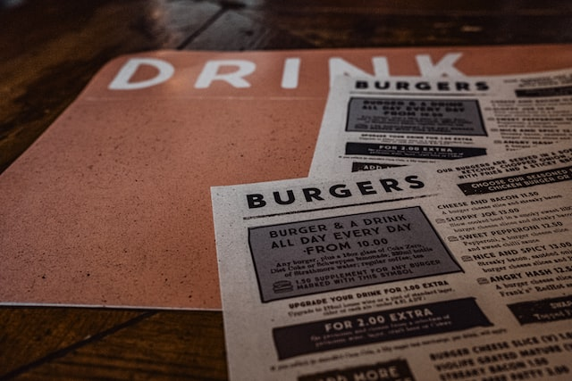
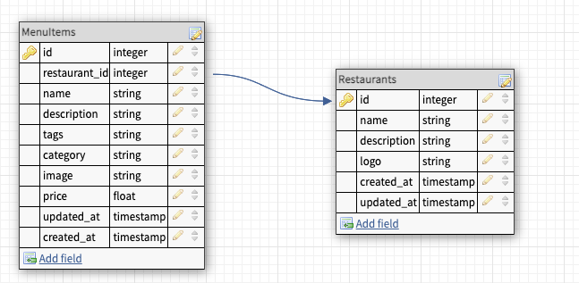

<div align="center">
  <h1>Menuify API</h1>
  <div align="center"></div>
</div>

<br>

# Project Overview

Menuify is an application created by students of [Turing School of Software and Design](https://turing.edu/). Front and Back-end teams collaborated on the design, development, and deployment processes throughout the course of the project.

Restaurant owners can easily add or delete menus and individual menu items. Images can be added by url, or by searching a collection of images sourced from the Photo Unsplash API.

Diners can readily find their desired menu with full-color images, descriptions, and prices. By placing QR codes on the tables, customers need only use their mobile device to access the user-friendly, aesthetically pleasing menu.  Specifications and requirements for this project can be found [here](https://mod4.turing.edu/projects/capstone/). <br>
[Deployed Application Here!](https://menu-ify.vercel.app/restaurant/200)

# Learning Goals

- Utilize Agile methodologies to ensure deployment of MVP

- Develop quality communication between front-end and back-end teams, which include daily stand-ups, weekly retros and an evolving process to achieve higher communication standards

- Create micro-services including a database and external API consumption to support application features for our end users

- Learn new technologies and tools (Python with FastApi Framework). That repo is found [here](https://github.com/menu-ify/menu-ify-be).

## Table of Contents

- [Project Overview](#project-overview)
- [Learning Goals](#learning-goals)
- [Setup](#developer-setup)
- [Tech and Tools](#tech-and-tools)
- [Schema](#database-schema)
- [Endpoints](#endpoints)
- [Known Issues and Future Goals](#known-issues-and-future-goals)
- [Contributors](#contributors)

## Developer Setup

1. Clone the respository
2. cd into the root directory
3. Install gem packages: `bundle install`
4. Setup the database: `rails db:{drop,create,migrate}`
5. Seed the database using the rake task: `rake csv_load:all`
6. Run `rails c` and then `Restaurant.count` and `MenuItem.count`. You should have 3 and 30 respectively
7. You may run the RSpec test suite locally with `bundle exec rspec`
8. Run `rails s` to use the localhost:3001 server

<br>

# Tech and Tools

## Built With

-  **2.7.2**
-  **5.2.8.1**
-  **3.12.0**
- 
- 
- 
- 

## Gems Used

- [Pry](https://github.com/pry/pry-rails)
- [Faraday](https://lostisland.github.io/faraday/)
- [Capybara](https://github.com/teamcapybara/capybara)
- [Figaro](https://github.com/laserlemon/figaro)
- [RSpec](https://github.com/rspec/rspec-metagem)
- [Simple-Cov](https://github.com/simplecov-ruby/simplecov)
- [Factory Bot for Rails](https://github.com/thoughtbot/factory_bot_rails)
- [Faker](https://github.com/faker-ruby/faker)
- [Shoulda Matchers](https://github.com/thoughtbot/shoulda-matchers)

## Other Tools

- Google Calender
- Github Projects
- Miro

# Database Schema



<br>

# Endpoints

The exposed endpoints are detailed below.

To test endpoints using your local server(http://localhost:3001), click on the Postman link below to fork exposed endpoints.

    
[](https://app.getpostman.com/run-collection/24609974-ee444c00-5719-4a1b-9f98-f07984581074?action=collection%2Ffork&collection-url=entityId%3D24609974-ee444c00-5719-4a1b-9f98-f07984581074%26entityType%3Dcollection%26workspaceId%3D2902cec5-b68c-4ae7-a836-ede59d44bd2d#?env%5BNew%20Environment%5D=W3sia2V5IjoidXJsIiwidmFsdWUiOiJodHRwczovL2pzb25wbGFjZWhvbGRlci50eXBpY29kZS5jb20iLCJlbmFibGVkIjp0cnVlLCJ0eXBlIjoiZGVmYXVsdCJ9XQ==)

Heroku Server: https://menu-ify-be.herokuapp.com

## End Point Examples

### Restaurants

<details close>
<summary>Get all restaurants</summary>
<br>

Request: <br>
```
GET /api/v1/restaurants
```
Example:

JSON Response Example:
```json 
{
    "data": [
        {
            "id": "100",
            "type": "restaurant",
            "attributes": {
                "name": "Pho Kyah",
                "description": "Experimental Asian fusion gastropub",
                "logo": "https://upload.wikimedia.org/wikipedia/commons/thumb/1/16/Ph%E1%BB%9F_v%E1%BB%8Bt_quay.jpg/640px-Ph%E1%BB%9F_v%E1%BB%8Bt_quay.jpg"
            }
        },
        {
            "id": "200",
            "type": "restaurant",
            "attributes": {
                "name": "Tim's Tiki Bar",
                "description": "All the aloha you can eat",
                "logo": "https://publicdomainvectors.org/photos/SteveLambert_Tiki_Bar.png"
            }
        },
        {...}
    ]
}
```
</details>

<details close>
<summary>Create a new restaurant</summary>
<br>

Request: <br>
```
POST /api/v1/restaurants
```
Example:

Body:
```
{ 
  "name": "West Colorado Burgers",
  "description": "Best burgers west of the Rockies!",
  "logo": "WestCOBurgers.calm"
}
```
JSON Response Example:
```json 
{
    "data": {
        "id": "123",
        "type": "restaurant",
        "attributes": {
            "name": "West Colorado Burgers",
            "description": "Best burgers west of the Rockies!",
            "logo": "WestCOBurgers.calm"
        }
    }
}
```
</details>

<details close>
<summary>Update existing restaurant</summary>
<br>

Request: <br>
```
PATCH /api/v1/restaurants/:restaurant_id
```
Example:

Body: 
```
{
  "name": "Western Colorado Burgers", 
  "description": "We're better than the other place", 
  "logo": "westerncoburgers.net"
}
```
JSON Response Example:
```json 
{
  "data": {
    "id": "123",
    "type": "restaurant",
    "attributes": {
        "name": "Western Colorado Burgers",
        "description": "We're better than the other place",
        "logo": "westerncoburgers.net"
    }
  }
}
```
</details>

<br>

### Menu Items
</details>

<details close>
<summary>Get all menu items from a restaurant</summary>
<br>

Request: <br>
```
GET /api/v1/restaurants/:restaurant_id/menu_items
```
Example:

```
JSON Response Example:
```json 
{
    "data": [
        {
            "id": "4",
            "type": "menu_item",
            "attributes": {
                "restaurant_id": 100,
                "name": "Pho with Shrimp",
                "description": "Vietnamese soup with shrimp and veggies",
                "tags": "gluten free",
                "category": "entree",
                "image": "https://thelemonbowl.com/wp-content/uploads/2021/02/Vietnamese-Shrimp-Pho_25_WEB.jpg",
                "price": 16.0
            }
        },
        {
            "id": "7",
            "type": "menu_item",
            "attributes": {
                "restaurant_id": 100,
                "name": "Asahi",
                "description": "Fresh clean beer from Japan",
                "tags": "gluten",
                "category": "draft beer",
                "image": "https://oakbeveragesinc.com/wp-content/uploads/2015/10/Asahi-Super-Dry-Bottle-500.jpg",
                "price": 5.5
            }
        },
        {
            "id": "5",
            "type": "menu_item",
            "attributes": {
                "restaurant_id": 100,
                "name": "Pho with Chicken",
                "description": "Vietnamese soup with chicken and veggies",
                "tags": "gluten free",
                "category": "entree",
                "image": "https://upload.wikimedia.org/wikipedia/commons/thumb/4/49/Vietnamese_Pho.jpg/640px-Vietnamese_Pho.jpg",
                "price": 13.5
            }
        },
        {
            "id": "6",
            "type": "menu_item",
            "attributes": {
                "restaurant_id": 100,
                "name": "Pho with Veggies",
                "description": "Vietnamese soup with veggies",
                "tags": "gluten free, vegetarian",
                "category": "entree",
                "image": "https://upload.wikimedia.org/wikipedia/commons/thumb/0/06/Vegetarian_Pho_%285541416031%29.jpg/640px-Vegetarian_Pho_%285541416031%29.jpg",
                "price": 11.0
            }
        },
        {
            "id": "8",
            "type": "menu_item",
            "attributes": {
                "restaurant_id": 100,
                "name": "Tiger Asian Lager",
                "description": "Easy-drinking Asian pilsner",
                "tags": "gluten",
                "category": "draft beer",
                "image": "https://upload.wikimedia.org/wikipedia/commons/thumb/9/99/Tiger_Beer_Bottles.png/640px-Tiger_Beer_Bottles.png",
                "price": 5.5
            }
        },
        {
            "id": "9",
            "type": "menu_item",
            "attributes": {
                "restaurant_id": 100,
                "name": "Purple dragon",
                "description": "Warm saki with a special blend of fruit juices and whole blueberries",
                "tags": "gluten free",
                "category": "cocktail",
                "image": "https://upload.wikimedia.org/wikipedia/commons/thumb/5/52/Purple_Rain_08.jpg/640px-Purple_Rain_08.jpg",
                "price": 8.5
            }
        },
        {
            "id": "62",
            "type": "menu_item",
            "attributes": {
                "restaurant_id": 100,
                "name": "Spring Roll",
                "description": "Fresh vegetarian spring rolls",
                "tags": "No tags added",
                "category": "appetizer",
                "image": "https://upload.wikimedia.org/wikipedia/commons/thumb/1/1f/Vietnamese_spring_roll.jpg/640px-Vietnamese_spring_roll.jpg",
                "price": 8.0
            }
        }
    ]
}
```
</details>


<details close>
<summary>Create a Menu Item</summary>
<br>

Request: <br>
```
POST /api/v1/restaurants/:restaurant_id/menu_items
```
Example:

Body:
```
{
    "name": "Spice Curls",
    "description": "The curly fry with a southwestern kick!",
    "tags": "vegetarian, vegan",
    "category": "Sides",
    "image": "https://www.lospolloshermanos.com/spice_curls.jpeg",
    "price": 4.95
}
```
JSON Response Example:
```json 
{
    "data": {
        "id": "92",
        "type": "menu_item",
        "attributes": {
            "restaurant_id": 100,
            "name": "Spice Curls",
            "description": "The curly fry with a southwestern kick!",
            "tags": "vegetarian, vegan",
            "category": "Sides",
            "image": "https://www.lospolloshermanos.com/spice_curls.jpeg",
            "price": 4.95
        }
    }
}
```
</details>

<details close>
<summary>Edit a Menu Item</summary>
<br>

Request: <br>
```
PATCH /api/v1/restaurants/:restaurant_id/menu_items
```
Example:

Body:
```
{
    "name": "Spice Curls!!!",
    "description": "The curly fry with a southwestern kick!",
    "tags": "vegetarian, vegan",
    "category": "Sides",
    "image": "https://www.lospolloshermanos.com/spice_curls.jpeg",
    "price": 4.50
}
```
JSON Response Example:
```json 
{
    "data": {
        "id": "92",
        "type": "menu_item",
        "attributes": {
            "restaurant_id": 100,
            "name": "Spice Curls!!!",
            "description": "The curly fry with a southwestern kick!",
            "tags": "vegetarian, vegan",
            "category": "Sides",
            "image": "https://www.lospolloshermanos.com/spice_curls.jpeg",
            "price": 4.50
        }
    }
}
```
</details>

<details close>
<summary>Delete a Menu Item</summary>
<br>

Request: <br>
```
POST /api/v1/restaurants
```
Example:

Body:
```
{ 
  "name": "West Colorado Burgers",
  "description": "Best burgers west of the Rockies!",
  "logo": "WestCOBurgers.calm"
}
```
JSON Response Example:
```json 
{
    "data": {
        "id": "123",
        "type": "restaurant",
        "attributes": {
            "name": "West Colorado Burgers",
            "description": "Best burgers west of the Rockies!",
            "logo": "WestCOBurgers.calm"
        }
    }
}
```
</details>


<br>

# Project Team
## Contributors

<table>
  <tr>
    <td></td>
    <td></td>
    <td></td>
  </tr>
  <tr>
    <td><div align="center"><strong>Emily Port</strong></div></td>
    <td><div align="center"><strong>Gabe Nunez</strong></div></td>
    <td><div align="center"><strong>Yuji Kosakowski</strong></td>

  </tr>
  <tr>
    <td>
      <div align="center">
        <a href="https://github.com/eport01">GitHub</a><br>
        <a href="https://www.linkedin.com/in/emily-port-3ab6389b/">LinkedIn</a>
      <div>
    </td>
    <td>
      <div align="center">
        <a href="https://github.com/MisterJackpots">GitHub</a><br>
        <a href="https://www.linkedin.com/in/gabriel-c-nunez/">LinkedIn</a>
      </div>
    </td>
    <td>
      <div align="center">
        <a href="https://github.com/Yuji3000">GitHub</a><br>
        <a href="https://www.linkedin.com/in/yujikosa/">LinkedIn</a>
      </div>
    </td>
  </tr>
</table>

## Project Manager

<table>
  <tr>
    <td></td>
  </tr>
  <tr>
    <td><div align="center"><strong>Heather Faerber</strong></div></td>
  </tr>
  <tr>
    <td>
      <div align="center"><a href="https://github.com/hfaerber">GitHub</a><br>
      <a href="https://www.linkedin.com/in/heather-faerber/">LinkedIn</a></div>
    </td>
  </tr>
</table>

## Advisor

<table>
  <tr>
    <td></td>
  </tr>
  <tr>
    <td><div align="center"><strong>Dara Rockwell</strong></div></td>
  </tr>
  <tr>
    <td>
      <div align="center"><a href="https://github.com/dara-rockwell">GitHub</a><br>
      <a href="https://www.linkedin.com/in/dcrockwell/">LinkedIn</a></div>
    </td>
  </tr>
</table>

<p align="right">(<a href="#top">back to top</a>)</p>


